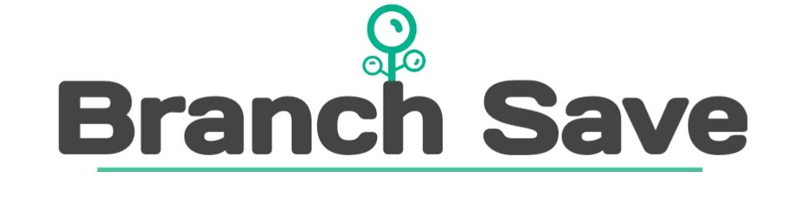

Structural programming language.

 
 


## Programming language for working with json
[Branch Save](https://goodmodslab-official.github.io) — Branch Save is a compiled programming language for developing your databases, created in java for the JVM. It uses a structured programming paradigm and has dynamic data typing.

Compiled in Json, XML and even vice versa. Simple code on Branch Save is easy to learn. Use it where you definitely need data storage, as well as markup for interfaces to compile XML files later.

## Why exactly Branch Save
The advantage of our language is that you can forget about the incomprehensible syntax of Json or XML. 
Branch Save is an easy syntax, for example, you can assign to a variable through a more convenient sign - ':' or through '='.
Compile two languages from one language at once! 
If you need to get Branch Save from Json and XML, this is also not a question, you can easily do it.

It is also worth noting that you can always change the value of a variable. 
For example, to get data from a single file and operate on them throughout the algorithm.

## Hello world and beyond 
This is how you can output a welcome message to a file.
```kotlin
Table = My cool table;
ValueTable: GoodModsLab;
import = ($)Table;
```
The result will surprise you!
```javascript
{"Table":"My cool table","ValueTable":"GoodModsLab","import":"My cool table"}
```
In order to start working in your project with our language, it is enough to install one source file, or install our editor.
The source code is in the source file.

## Variables
In our Branch Save programming language, each element of the code (Token) consists of a key and its value, even operators, these are peculiar variables. 
Look at what they are
```kotlin
MyVar = value;
MyVar2 : value2;

$MyInvisibleVar = invisibleValue;
$MyInvisibleVar2 : invisibleValue2;
```

If you do not want to set the value of a variable, leave it without assignment and it will be equal to `null`
```kotlin
nullVar;
$nullInvisibleVar;
```

## Keywords and operators
Keywords are the very keywords with which you can create an algorithm for working on data from memory cells (variables). 
Here is the easiest way to use them (we are writing adding a key):
```kotlin
Test = 50;
$add = Test2;
$add = Test3;

Test2 = ($)Test;
$remove = Test3;
```
Operators are keywords in arguments (variable values). 
Some make it easier to work by getting data from another file, some are used for counting. 
And others get values from another memory location.

```kotlin
$comment = ($) - Import value from variable;
Source = 5;
Import = ($)Source;

$comment = ($math) - Mathematic expressions;
MathVar = ($math) 50-6 + 7 / 2 + cos(30);
```
## Getting Branch Save / Documentation
To get started with Branch Save, just install your favorite development environment. However, for a start, we recommend using our editor, for familiarization. Our tools and development environment will help you create a project for Branch Save. 

If you want to run the Branch Save code on the server, then install BranchSave.jar and write this command (Also make sure you have a Java server.) 

`java -jar BranchSave.jar`
  
 See our __[website](https://goodmodslab-official.github.io)__ for instructions on how to get started with this, or read our [wiki](https://goodmodslab-organization.gitbook.io/branch-save-v.1.0.2/): 
 * Project creation for Branch Save
 * Math expression test
 * Tutorials and demos

## Partnership and cooperation
You can help us develop and improve this programming language.
You can ask questions in a special section, or you can change the language script for yourself and share it with us.
We welcome everyone, the list of project participants will be posted below.
